# 01 | ？
> 一文读懂DDD领域驱动设计
> 借鉴了:  https://zhuanlan.zhihu.com/p/695345137

# 1. 领域驱动设计简介
## 1.1 什么是领域驱动设计
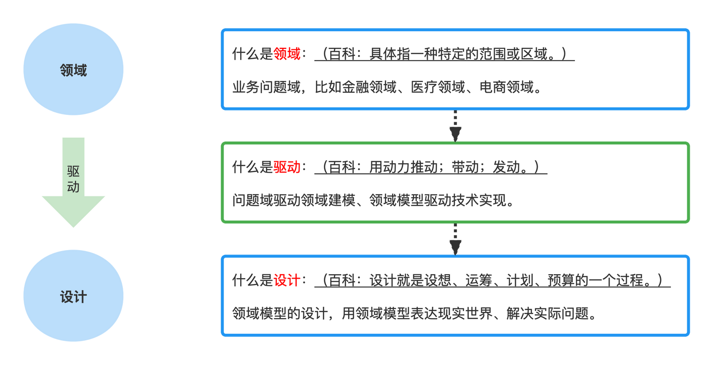

2004 年埃里克·埃文斯（Eric Evans）发表了《领域驱动设计》（Domain-Driven Design

–Tackling Complexity in the Heart of Software）这本书，从此领域驱动设计（Domain Driven Design，简称 DDD）诞生。DDD 核心思想是通过领域驱动设计方法定义领域模型，从而确定业务和应用边界，保证业务模型与代码模型的一致性。

DDD是一种设计思想，通过事件风暴使用通用语言对业务进行领域建模，通过限界上下文进行合理的领域拆分，可以使得领域模型转向微服务的设计和落地，从而解决复杂软件难以理解，难以演进，也可以解决微服务业务界限难以界定的问题。

## 1.2 为什么要用领域驱动设计
优点
DDD最大的好处是：接触到需求第一步就是考虑领域模型，而不是将其切割成数据和行为，然后数据用数据库实现，行为使用服务实现，最后造成需求的首肢分离。DDD让你首先考虑的是业务语言，而不是数据。DDD强调业务抽象和面向对象编程，而不是过程式业务逻辑实现。重点不同导致编程世界观不同。

面向对象设计，数据行为绑定，告别贫血模型；
降低复杂度，分而治之；
优先考虑领域模型，而不是切割数据和行为；
业务语义显性化，准确传达业务规则，业务优先；
代码即设计，通过领域设计即可很清晰的实现代码；
它通过边界划分将复杂业务领域简单化，帮我们设计出清晰的领域和应用边界，可以很容易地实现业务和技术统一的架构演进；
领域知识共享，提升协助效率；
增加可维护性和可读性，延长软件生命周期；
中台化的基石。

缺点
将数据不⼀致的影响⾯进⼀步放⼤，由微服务级别放⼤到微服务内的聚合级别。

## 1.3 领域驱动设计过程
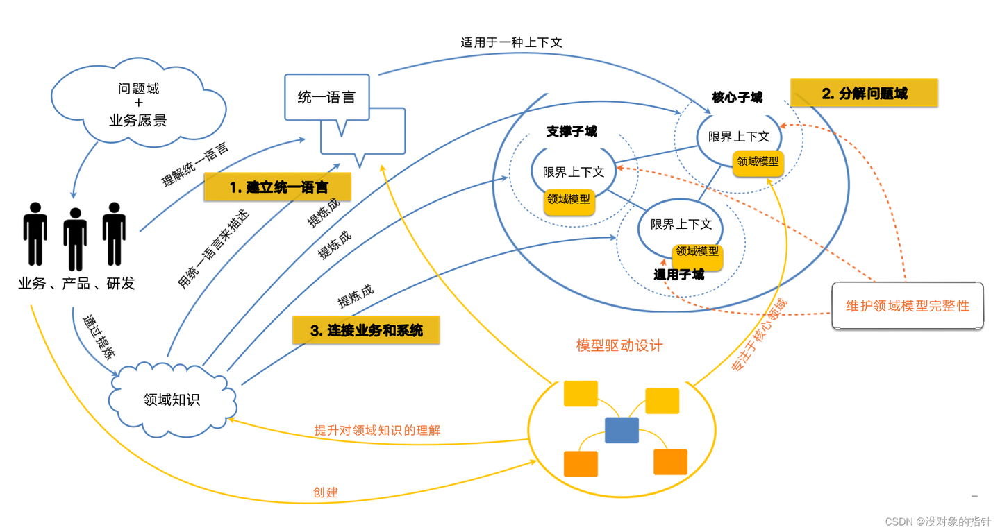

# 对于DDD，我们需要学习什么？
## DDD的知识体系
DDD 的核心知识体系，具体包括：领域、子域、核心域、通用域、支撑域、限界上下文、实体、值对象、聚合和聚合根等概念。

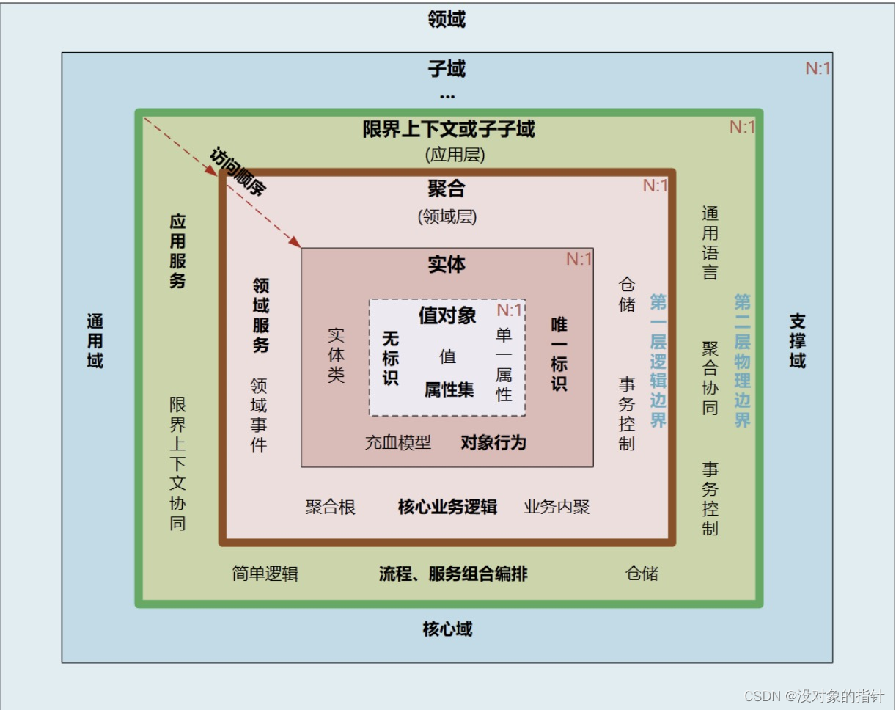

## 2.1DDD的战略、战术设计
### 2.1.1战略设计
战略设计也叫战略建模，从业务视角出发，对业务需求进行拆解分析，划分子域，梳理限界上下文，通过领域语言从战略层面进行领域划分以及构建领域模型。并且在在构建领域模型的过程中梳理出业务对应的聚合、实体、以及值对象。

DDD 战略设计会建立领域模型，领域模型可以用于指导微服务的设计和拆分。事件风暴是建立领域模型的主要方法，它是一个从发散到收敛的过程。它通常采用用例分析、场景分析和用户旅程分析，尽可能全面不遗漏地分解业务领域，并梳理领域对象之间的关系，这是一个发散的过程。事件风暴过程会产生很多的实体、命令、事件等领域对象，我们将这些领域对象从不同的维度进行聚类，形成如聚合、限界上下文等边界，建立领域模型，这就是一个收敛的过程。
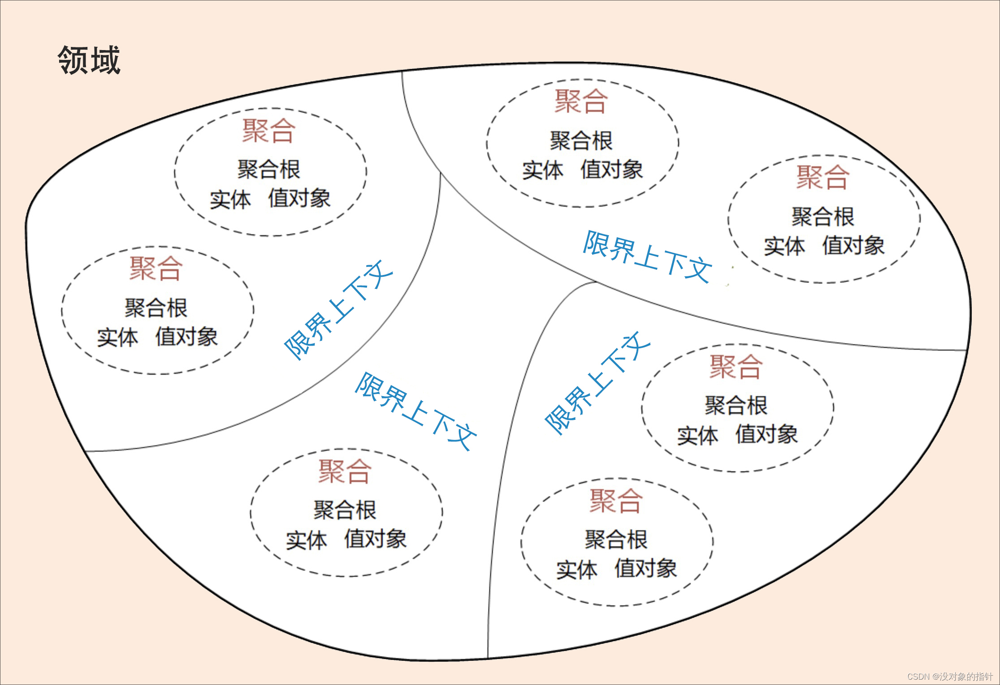

### 2.2.2 战术设计
战术设计也称为战术建模，从技术视角出发，以领域模型基础，通过限界上下文作为服务划分的边界进行微服务拆分，在每个微服务中进行领域分层，实现领域服务，从而实现领域模型对于代码映射目的，最终实现DDD的落地实。包括：实体、值对象、聚合、聚合根、资源库、工厂、领域服务、领域事件、应用服务等代码逻辑的设计和实现。

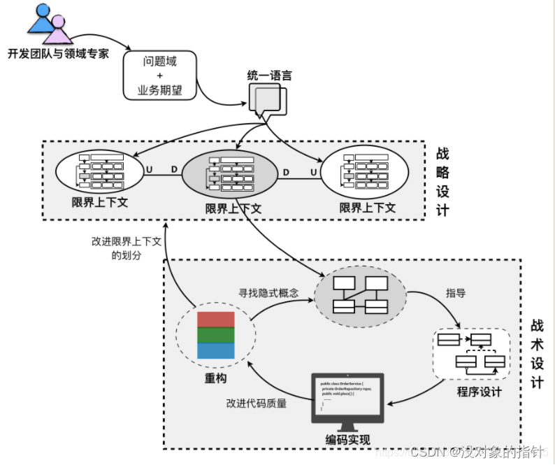

## 3. DDD的战略设计
DDD的战略设计主要包括通用语言、领域/子域、限界上下文和架构风格等概念。
### 3.1 通用语言 - 定义上下文的含义
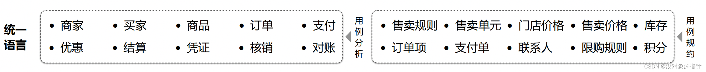
定义：提炼领域知识的产出物，体现在两个方面：① 统一的领域术语；②领域行为描述。
如何获取：统一语言就是需求分析的过程，也是团队中各个角色就系统目标、范围与具体功能达成一致的过程。
强调统一：无论是与领域专家的讨论，还是最终的实现代码，都使用相同的术语。
强调约束：既要有内涵也要有外延。

定义上下文的含义：在事件风暴中，通过团队交流达成共识的，能简单清晰准确地描述业务含义和规则的言语就是通用语言。

注意：通用语言贯穿 DDD 的整个设计过程。作为项目团队沟通和协商形成的统一语言，在说某通用语言时，必须要限定在某个上下文内，以确保每个上下文含义在它特定的边界内都有唯一的含义。

### 3.2 领域和子域 - 确定逻辑边界
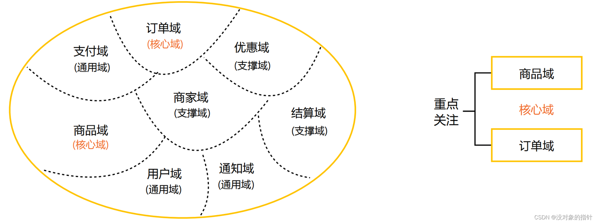

#### 3.2.1 领域
@汉语词典：“领域是从事一种专门活动或事业的范围、部类或部门。”

@百度百科：“具体指一种特定的范围或区域。”

两个解释有一个共同点：范围。领域就是用来确定范围的，范围即边界，这也是 DDD 在设计中不断强调边界的原因。

在研究和解决业务问题时，DDD 会按照一定的规则将业务领域进行细分，当领域细分到一定的程度后，DDD 会将问题范围限定在特定的边界内，在这个边界内建立领域模型，进而用代码实现该领域模型，解决相应的业务问题。简言之，`DDD 的领域就是这个边界内要解决的业务问题域。

#### 3.2.2 子域
概念
领域按照一定的业务规则细分，进而划分出多个子域，每个子域对应一个更小的业务范围。

过程
把问题域逐步分解，降低业务理解和系统实现的复杂度。

分类
核心域：唯一的定义明确的领域模型，业务的核心部分，公司核心竞争力。

支撑域：具有企业特性，具备"定制开发"的特性。

通用域：系统中用到的通用系统，例如：认证，权限等。甚至可以采购现成的。

## 3.3 限界上下文（Bounded Context） - 定义领域边界的利器
我们可以将限界上下文拆解为两个词：限界和上下文。限界就是领域的边界，而上下文则是语义环境。通过领域的限界上下文，我们就可以在统一的领域边界内用统一的语言进行交流

限界上下文：用来封装通用语言和领域对象，提供上下文环境，保证在领域之内的一些术语、业务相关对象等（通用语言）有一个确切的含义，没有二义性。这个边界定义了模型的适用范围，使团队所有成员能够明确地知道什么应该在模型中实现，什么不应该在模型中实现。

## 3.4 上下文映射图（Context Mapping） - 集成
上下文映射图的英文是 Context Map 其实这个翻译挺难理解的，上下文映射图其实就是不同上下文是如何进行交流的关系。由于上下文映射图内容比较少。以下内容摘自《领域驱动设计精粹》。

### 3.4.1 三种集成方式
RPC 方式
消息队列或者发布 - 订阅机制
RESTful 方式

### 3.4.2 上下文映射的种类
合作关系
合作关系存在于两个团队之间。每个团队各自负责一个限界上下文。两个团队通过互相依赖的一整套目标联合起来形成合作关系。一损俱损，一荣俱荣。由于相互之间的联系非常紧密，他们经常会对同步日程安排和相互关联的工作。他们还必须使用持续集成对保持集成工作协调一致。

共享内核
两个或者多个团队之间共享着一个小规模但却通用的模型。团队必须就要共享的模型元素达成一致。有可能他们当中只有一个团队会维护，构建及测试共享模型的代码。

客户 - 供应商
两个限界上下文中，一方是供应商处于上游，一方是客户方处于下游。支配这种关系的是供应商，因为它必须提供客户需要的东西。客户需要与供应商共同制订规划来满足各种预期，但最终却还是由供应商来决定客户获得的是什么以及何时获得。

跟随者
上游团队没有任何动机去满足下游团队的具体需求。由于各种原因，下游团队也无法投入资源去翻译上游模型的通用语言来适应自己的特定需求，因此只能顺应上游的模型。例如当一个团队需要与一个非常庞大复杂的模型集成，而且这个模型已经非常成熟时，团队往往会成为它的跟随者。

防腐层
这是最具防御性的上下文映射关系，下游团队在其通用语言（模型）和位于它上游的通用语言（模型）之间创建了一个翻译层。防腐层隔离了下游模型与上游模型，并完成了两者之间的翻译。所以，这也是一种集成方式。

开放主机服务
开放主机服务会定义一套协议或者接口，让限界上下文可以被当做一组服务访问。该协议是开放的，所有需要与限界上下文进行集成的客户端都可以相对轻松地使用它。通过应用程序编程接口提供的服务都有详细的文档，用起来也很舒服。
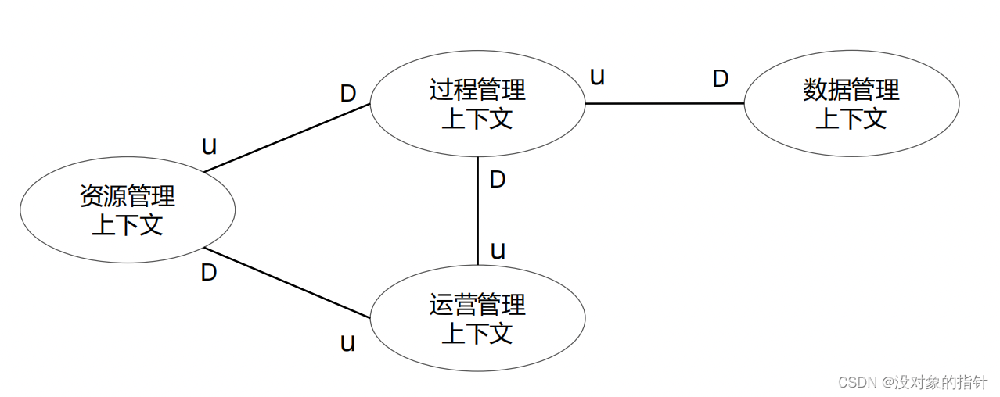

# 4. DDD的战术设计
总体设计思路：面向对象。
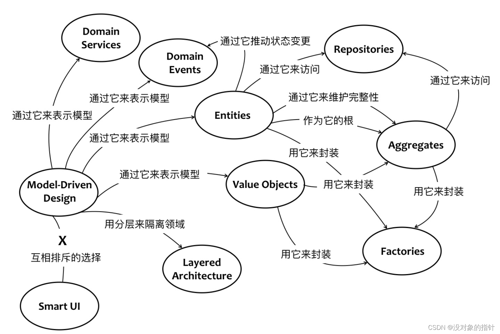

## 4.1 实体和值对象
在 DDD 中，实体和值对象是很基础的领域对象。实体一般对应业务对象，它具有业务属性和业务行为；而值对象主要是属性集合，对实体的状态和特征进行描述。但实体和值对象都只是个体化的对象，它们的行为表现出来的是个体的能力。

### 4.1.1 实体（Entity）
定义：
DDD 中的一类对象，拥有唯一标识符，经历各种状态变更后仍然可以保持一致，对这类对象而言，重要的是延续性和标识，（对象的延续性和标识可以超出软件的生命周期）而非属性。

    特点：
具备id标识，可以通过id进行相等性比较，实体在聚合内唯一，但是状态可变，它依附于聚合根，它的生命周期由聚合根管理，实体一般都会持久化，跟数据持久化对象存在多种对应关系（一对一，一对多，多对一，1对0），实体可以引用聚合中的聚合根，实体，值对象。

### 4.1.2 值对象（Value Object）
定义：
通过对象的属性值来识别的对象是值对象，它将多个相关属性组合为一个概念整体。它是没有标识符的对象。

特点：
值对象描述了领域中的一件东西，这个东西是不可变的，无生命周期，用完即失效，值对象之间通过属性值判断相等性，他的核心是值，是一组概念完整的属性集合，用于描述实体的特征和状态，值对象尽量只引用值对象。

简单来说： 值对象本质就是一个集合。

意义：
领域建模过程中，值对象可以保证属性归类的清晰和概念的完整性。

### 4.1.3 举个栗子
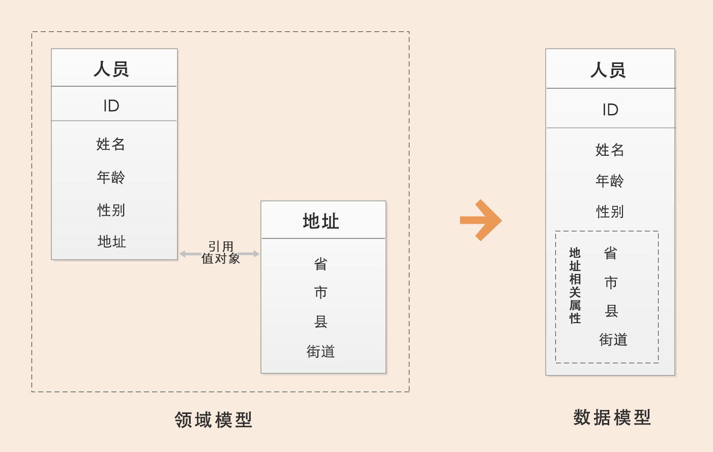
人员实体原本包括：姓名、年龄、性别以及人员所在的省、市、县和街道等属性。这样显示地址相关的属性就很零碎了对不对？现在，我们可以将 “省、市、县和街道等属性” 拿出来构成一个“地址属性集合”，这个集合就是值对象了。

## 4.2 聚合和聚合根
### 4.2.1 聚合
定义：
领域模型内的实体和值对象就好比个体，而能让实体和值对象协同工作的组织就是聚合，它用来确保这些领域对象在实现共同的业务逻辑时，能保证数据的一致性。

作用：
① 确保领域对象在实现共同的业务逻辑时，能保证数据的一致性。

② 聚合是数据修改和持久化的基本单元，每一个聚合对应一个仓储，实现数据的持久化。

③ 实现微服务的"高内聚、低耦合"：聚合有一个聚合根和上下文边界，这个边界根据业务单一职责和高内聚原则，定义了聚合内部应该包含哪些实体和值对象，而聚合之间的边界是松耦合的。

特点：
高内聚、低耦合，它是领域模型中最底层的边界，可以作为拆分微服务的最小单位，但我不建议你对微服务过度拆分。但在对性能有极致要求的场景中，聚合可以独立作为一个微服务，以满足版本的高频发布和极致的弹性伸缩能力。

一个微服务可以包含多个聚合，聚合之间的边界是微服务内天然的逻辑边界。有了这个逻辑边界，在微服务架构演进时就可以以聚合为单位进行拆分和组合了，微服务的架构演进也就不再是一件难事了。

### 4.2.2 聚合根
定义：
如果把聚合比作组织，聚合根则是组织的负责人，聚合根也叫做根实体，它不仅仅是实体，还是实体的管理者。

作用：
① 避免由于复杂数据模型缺少统一的业务规则控制，而导致聚合、实

体之间数据不一致性的问题。

② 作为实体，具备自己的业务属性，业务行为，业务逻辑。

③ 作为聚合的管理者， 在聚合内部，负责协调实体和值对象按照固定的业务规则协同完成共同的业务逻辑。

④ 聚合之间，它还是聚合对外的接口人，以聚合根 ID 关联的方式接受外部任务和请求，在上下文内实现聚合之间的业务协同。也就是说，聚合之间通过聚合根 ID 关联引用，如果需要访问其它聚合的实体，就要先访问聚合根，再导航到聚合内部实体，外部对象不能直接访问聚合内实体。

特点：
聚合根是实体，有实体的特点，具有全局唯一标识，有独立的生命周期。一个聚合只有一个聚合根，聚合根在聚合内对实体和值对象采用直接对象引用的方式进行组织和协调，聚合根与聚合根之间通过 ID 关联的方式实现聚合之间的协同。

### 4.2.3 怎样设计聚合

采用事件风暴（用例分析、场景分析和用户旅程分析等方法），列出所有业务行为和事件，梳理出这些行为过程中的实体和值对象（领域对象）。
从众多实体中选出作为对象管理者的根实体，也叫聚合根。
根据业务单一职责和高内聚原则，找出与聚合根关联的所有的紧密依赖的实体和值对象。
在聚合内根据 聚合根、实体、值对象 的依赖关系，画出对象的引用和依赖模型。
多个聚合根据业务语义和上下文一起划分到同一个限界上下文中。
DDD 领域建模通常采用事件风暴，它通常采用用例分析、场景分析和用户旅程分析等方法，通过头脑风暴列出所有可能的业务行为和事件，然后找出产生这些行为的领域对象，并梳理领域对象之间的关系，找出聚合根，找出与聚合根业务紧密关联的实体和值对象，再将聚合根、实体和值对象组合，构建聚合。

下面我们以保险的投保业务场景为例，看一下聚合的构建过程主要都包括哪些步骤：
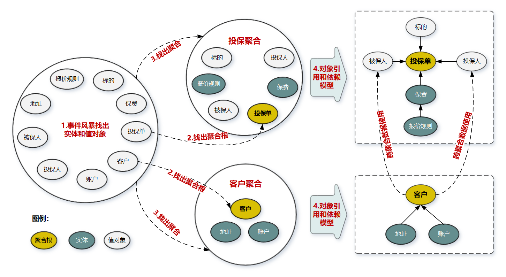

### 4.2.4 聚合的一些设计原则
在一致性边界内建模真正的不变条件：聚合内的实体和值对象按照统一的业务规则运行，实现数据对象的一致性。
设计小聚合：降低由于业务过大导致的聚合重构的可能性。
通过唯一标志引用其他聚合：聚合之间通过关联外部聚合根 id 的方式引用。
在边界之外使用最终一致性：在一次事务中，最多只能更改一个聚合的状态。若一次业务操作导致多个聚合状态的修改。可以采用领域事件异步修改相关的聚合。
通过应用层实现跨聚合的服务调用：为实现微服务内聚合之间的解耦，以及未来以聚合为单位的微服务组合和拆分，应避免跨聚合的领域服务调用和跨聚合的数据库表关联。

## 4.3 领域事件（Domain Event）
领域事件是解耦微服务的关键，也是领域模型中非常重要的一部分，用来表示领域中发生的事件。一个领域事将导致进一步的业务操作，在实现业务解耦的同时, 还有助于形成完整的业务闭环。
### 4.3.1 概念
领域事件是解耦微服务的关键，也是领域模型中非常重要的一部分，用来表示领域中发生的事件。一个领域事将导致进一步的业务操作，在实现业务解耦的同时, 还有助于形成完整的业务闭环。
### 4.3.2 如何识别领域事件
在做用户旅程或者场景分析时，我们要捕捉业务、需求人员或领域专家口中的关键词：“如果发生……，则……”、“当做完……的时候，请通知……”、“发生……时，则……” 等。在这些场景中，如果发生某种事件后，会触发进一步的操作，那么这个事件很可能就是领域事件。

② 领域事件可以切断领域模型之间的强依赖关系，事件发布完成之后，发布方不必关系订阅方事件处理是否成功，这样可以实现领域模型之间的解耦，维护领域模型的独立性和数据的一致性。在领域模型映射到微服务系统架构时，领域事件可以解耦微服务，微服务之间的数据不必要求强一致性，而是基于事件的最终一致性。

### 4.3.3 领域事件的使用场景
微服务内的领域事件
当领域事件发生在微服务内的聚合之间，领域事件发生后完成事件实体构建和事件数据持久化，发布方聚合将事件发布到事件总线，订阅方接收事件数据完成后续业务操作。

微服务内大部分事件的集成，都发生在同一个进程内，进程自身可以很好地控制事务，因此不一定需要引入消息中间件。但一个事件如果同时更新多个聚合，按照 DDD “一次事务只更新一个聚合” 的原则，你就要考虑是否引入事件总线。但微服务内的事件总线，可能会增加开发的复杂度，因此你需要结合应用复杂度和收益进行综合考虑。

微服务内应用服务，可以通过跨聚合的服务编排和组合，以服务调用的方式完成跨聚合的访问，这种方式通常应用于实时性和数据一致性要求高的场景。这个过程会用到分布式事务，以保证发布方和订阅方的数据同时更新成功。

微服务之间的领域事件
跨微服务的领域事件会在不同的限界上下文或领域模型之间实现业务协作，其主要目的是实现微服务解耦，减轻微服务之间实时服务访问的压力。

领域事件发生在微服务之间的场景比较多，事件处理的机制也更加复杂。跨微服务的事件可以推动业务流程或者数据在不同的子域或微服务间直接流转。

跨微服务的事件机制要总体考虑事件构建、发布和订阅、事件数据持久化、消息中间件，甚至事件数据持久化时还可能需要考虑引入分布式事务机制等。

微服务之间的访问也可以采用应用服务直接调用的方式，实现数据和服务的实时访问，弊端就是跨微服务的数据同时变更需要引入分布式事务，以确保数据的一致性。分布式事务机制会影响系统性能，增加微服务之间的耦合，所以我们还是要尽量避免使用分布式事务。

### 4.3.4 领域事件相关案例
介绍一个保险承保业务过程中有关领域事件的案例：一个保单的生成，经历了很多子域、业务状态变更和跨微服务业务数据的传递。这个过程会产生很多的领域事件，这些领域事件促成了保险业务数据、对象在不同的微服务和子域之间的流转和角色转换。

事件起点：客户购买保险 - 业务人员完成保单录入 - 生成投保单 - 启动缴费动作。
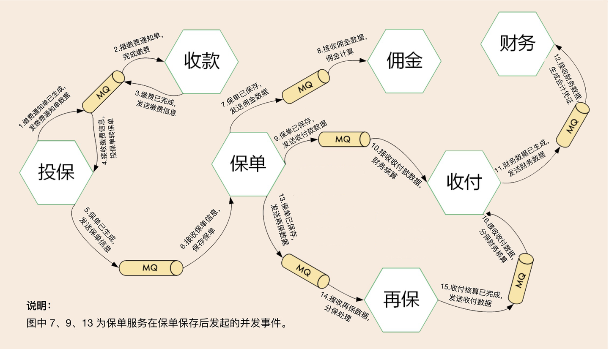

### 4.3.5 领域事件总体架构
领域事件的执行需要一系列的组件和技术来支撑。我们来看一下这个领域事件总体技术架构图，领域事件处理包括：事件构建和发布、事件数据持久化、事件总线、消息中间件、事件接收和处理等。
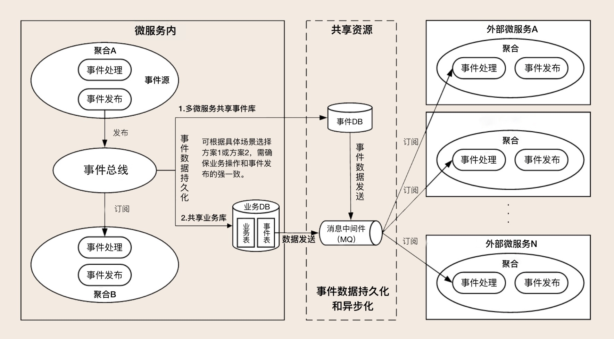

### 4.3.6 领域事件运行机制相关案例
承保业务流程的缴费通知单事件来解释领域事件的运行机制：这个领域

事件发生在投保和收款微服务之间。发生的领域事件是：缴费通知单已生成。下一步的业务操作是：缴费。

事件起点：出单员生成投保单，核保通过后，发起生成缴费通知单的操作。
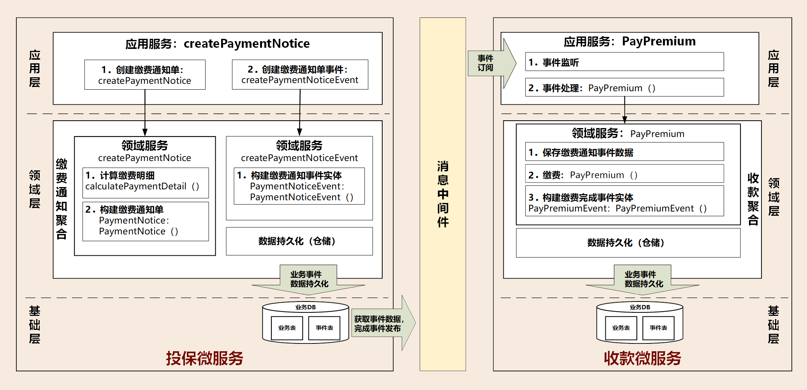

## 4.4 领域服务(Domain Service)和应用服务(Application Service)
战略层语境：

领域服务通常指相对聚焦的底层支撑域/通用域服务
应用服务通常指面向业务场景负责功能组装的服务

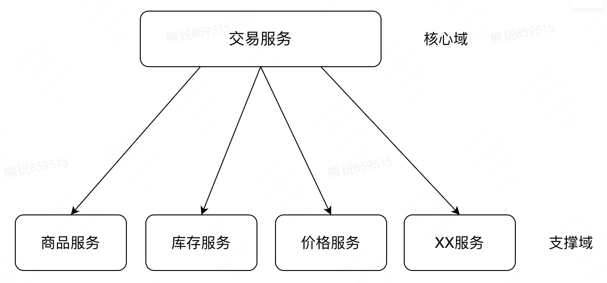
战术层语境：

领域服务指领域建模工具集中所指的“领域服务”
应用服务指面向场景的技术实现组装
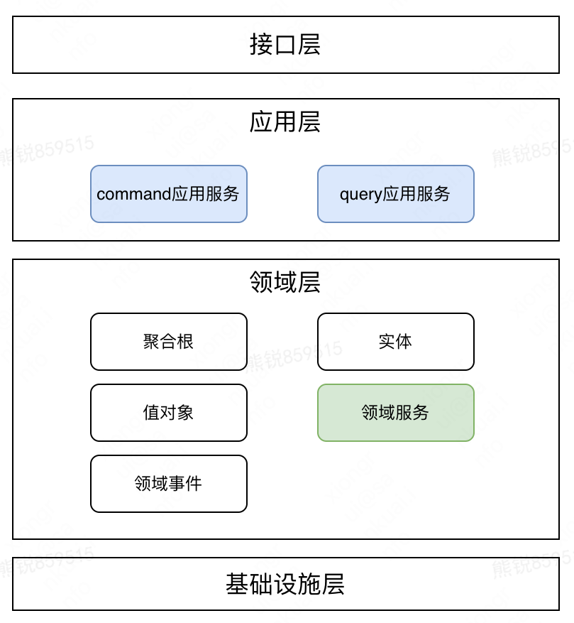

思考：在战术层语境，应用和领域仅仅是技术和业务的分离吗？能否参考战略层语境？
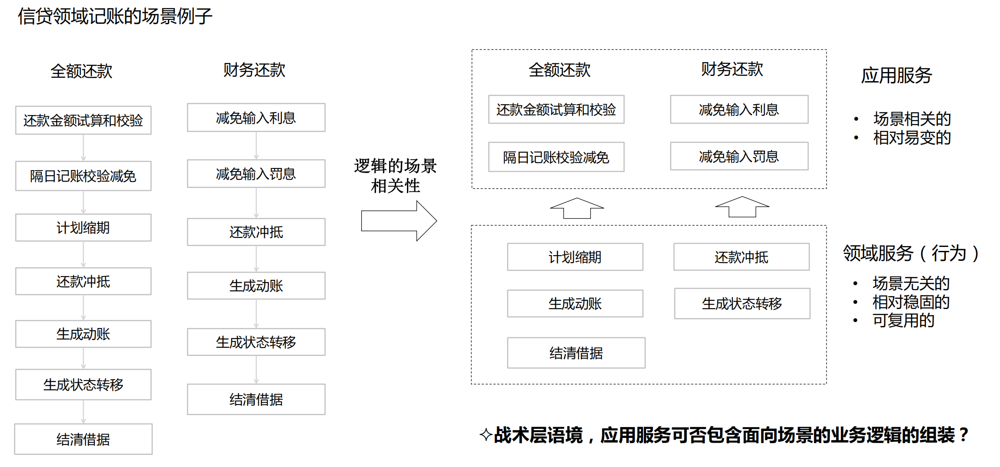

## 4.5 框架设计
总体设计思路：分层、CQRS、EDA

### 4.5.1 分层架构
在《实现领域驱动设计》一书中，DDD 分层架构有一个重要的原则：每层只能与位于其下方的层发生耦合。分层架构可以简单分为两种，即严格分层架构和松散分层架构。在严格分层架构中，某层只能与位于其直接下方的层发生耦合，而在松散分层架构中，则允许某层与它的任意下方层发生耦合。
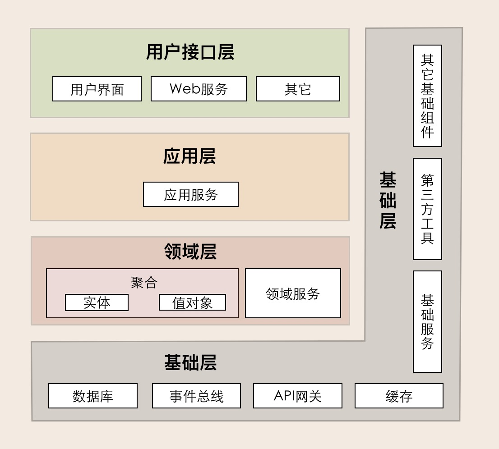
关于分层架构的优点，Martin Fowler在《Patterns of Enterprise Application Architecture》一书中给出了答案：

开发人员可以只关注整个结构中的某一层。
可以很容易的用新的实现来替换原有层次的实现。
可以降低层与层之间的依赖。
有利于标准化。
利于各层逻辑的复用。
“金无足赤，人无完人”，分层架构也不可避免具有一些缺陷：

降低了系统的性能。这是显然的，因为增加了中间层，不过可以通过缓存机制来改善。
可能会导致级联的修改。这种修改尤其体现在自上而下的方向，不过可以通过依赖倒置来改善。

### 4.5.2 六边形架构
六边形架构是 Alistair Cockburn 在2005年提出，解决了传统的分层架构所带来的问题，实际上它也是一种分层架构，只不过不是上下或左右，而是变成了内部和外部。六边形架构又名“端口-适配器架构”：
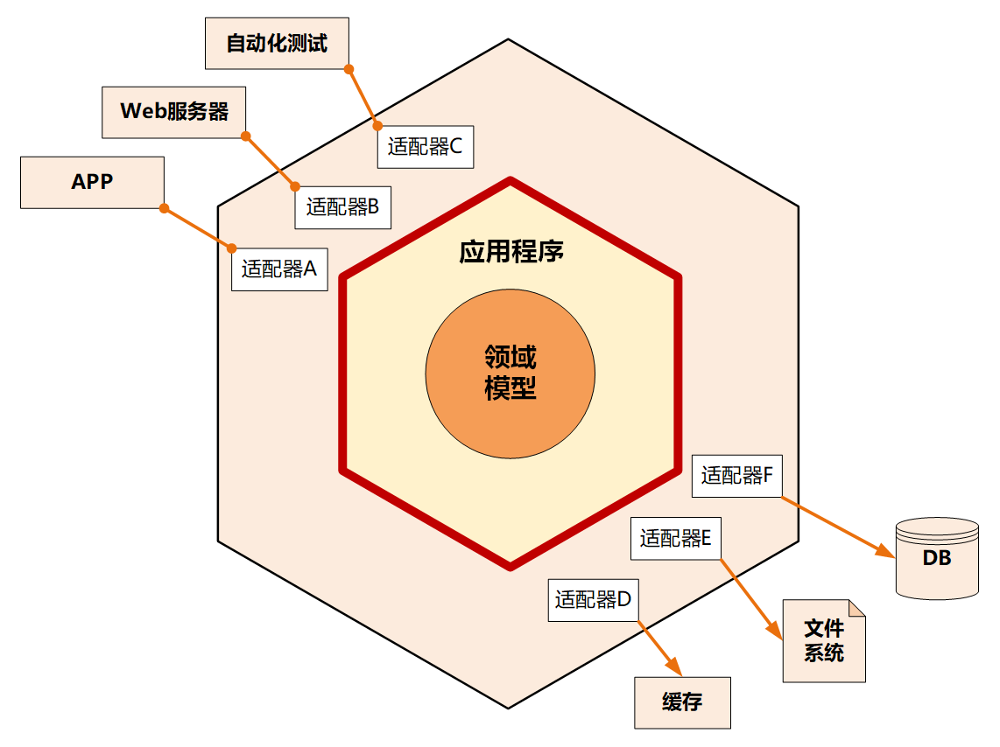
六边形架构又称为端口-适配器架构，这个名字更容器理解。六边形架构将系统分为内部（内部六边形）和外部，内部代表了应用的业务逻辑，外部代表应用的驱动逻辑、基础设施或其他应用。内部通过端口和外部系统通信，端口代表了一定协议，以API呈现。一个端口可能对应多个外部系统，不同的外部系统需要使用不同的适配器，适配器负责对协议进行转换。这样就使得应用程序能够以一致的方式被用户、程序、自动化测试、批处理脚本所驱动，并且，可以在与实际运行的设备和数据库相隔离的情况下开发和测试。

### 4.5.3 CQRS架构－命令查询职责分离
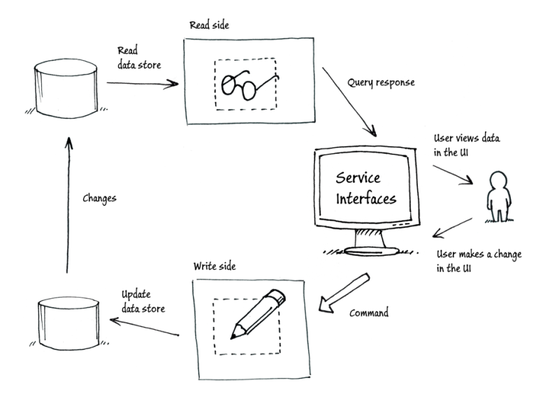
CQRS本身只是一个读写分离的架构思想，全称是：Command Query Responsibility Segregation，即命令查询职责分离，表示在架构层面，将一个系统分为写入（命令）和查询两部分。一个命令表示一种意图，表示命令系统做什么修改，命令的执行结果通常不需要返回；一个查询表示向系统查询数据并返回。

CQRS架构中，另外一个重要的概念就是事件，事件表示命令操作领域中的聚合根，然后聚合根的状态发生变化后产生的事件。

# 5. 领域驱动落地框架
## 5.1 COLA框架
cola框架是阿里大佬张建飞（Frank） 基于DDD构建的平台应用框架。“让COLA真正成为应用架构的最佳实践，帮助广大的业务技术同学，脱离酱缸代码的泥潭！”

csdn地址：https://blog.csdn.net/significantfrank/article/details/110934799

## 5.2 leave-sample
中台架构与实现 DDD和微服务，清晰地提供了从战略设计到战术设计以及代码落地。

leave-sample地址：https://gitee.com/serpmelon/leave-sample

## 5.3 dddbook
阿里技术专家详解DDD系列，例子精炼，项目代码结构与rdfa相似，极具参考价值。

dddbook地址：https://developer.aliyun.com/article/719251

## 5.4 Xtoon

xtoon-boot是基于领域驱动设计（DDD）并支持SaaS平台的单体应用开发脚手架。重点研究如何应用。xtoon-boot提供了完整落地方案和企业级手脚架；

gitee地址：https://gitee.com/xtoon/xtoon-boot

github地址：https://github.com/xtoon/xtoon-boot

## 5.5 DDD Lite
DDD 领域驱动设计微服务简化版，简洁、高效、值得重点研究，主要问题是持久化采用的JPA，担心技术人员不熟悉，理论篇。

gitee地址：https://gitee.com/litao851025/geekhalo-ddd

快速入门：https://segmentfault.com/a/1190000018464713

快速构建新闻系统：https://segmentfault.com/a/1190000018254111

## 5.6 ruoyi_cloud

若依快速开发平台，以该项目建立对阳光智采和rdfa的技术框架基准线。

gitee地址：https://gitee.com/y_project/RuoYi-Cloud

## 5.7 Axon Framework
Axon Framework 是用来帮助开发人员构建基于命令查询责任分类(Command Query Responsibility Segregation: CQRS)设计模式的可伸缩、可扩展和可维护应用程序的框架。你只需要把工作重心放在业务逻辑的设计上。通过一些 Annotation ，Axon 使得你的代码和测试分离。

https://www.oschina.net/p/axon

https://www.jianshu.com/p/15484ed1fbde

