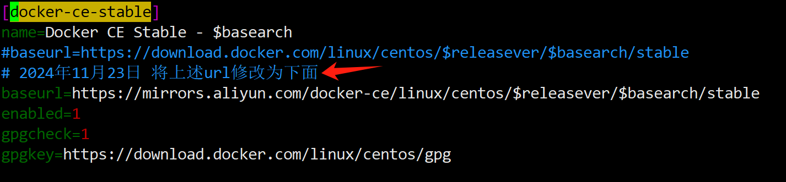
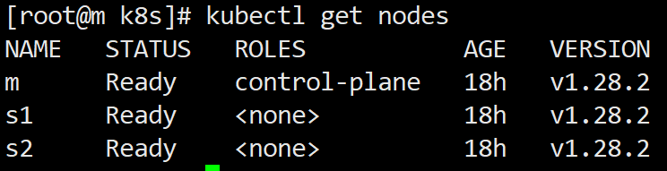
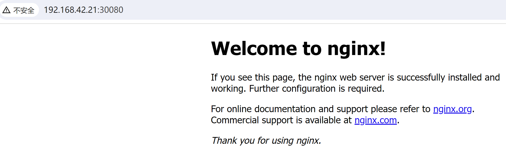

# 传统方式安装k8s集群
通过KubeSphere方式应该简单太多。但是本次采用传统方式安装，参考了如下安装步骤:
> https://blog.csdn.net/qq_41076892/article/details/133872947?utm_medium=distribute.pc_relevant.none-task-blog-2~default~baidujs_baidulandingword~default-4-133872947-blog-142829773.235^v43^pc_blog_bottom_relevance_base7&spm=1001.2101.3001.4242.3&utm_relevant_index=7

<br/>自己做了些优化改动(否则虚拟机安装可能会有卡点)；本次操作的是虚拟机3个节点

| ip            | node name  |
|---------------|------------|
| 192.168.42.22 | s1         |
| 192.168.42.22 | s2         |
| 192.168.42.21 | m          |

## 安装步骤

### 准备步骤
- 准备阶段，如下操作针对所有节点
```bash
# 更新yum源
mv /etc/yum.repos.d/CentOS-Base.repo /etc/yum.repos.d/CentOS-Base.repo.backup
wget -O /etc/yum.repos.d/CentOS-Base.repo https://mirrors.aliyun.com/repo/Centos-7.repo 
yum clean all
yum makecache
yum -y update
yum install -y conntrack ipvsadm ipset jq sysstat curl iptables libseccomp
    
# 设置系统主机名和host文件
# /etc/hosts 添加如下内容：
192.168.42.21 m
192.168.42.22 s1
192.168.42.22 s2

# 对应的节点执行
sudo hostnamectl set-hostname m
sudo hostnamectl set-hostname s1
sudo hostnamectl set-hostname s2

禁用iptables和firewalld服务
systemctl stop firewalld
systemctl disable firewalld
systemctl stop iptables
systemctl disable iptables

# 禁用selinux
# 永久关闭
sed -i 's/enforcing/disabled/' /etc/selinux/config
# 临时关闭
setenforce 0

禁用swap分区
# 临时关闭
swapoff -a
# 永久关闭
# vim /etc/fstab
    将行 
    /dev/mapper/xxx    swap   xxx
    注释

# 调整内核参数，对于 K8S
cat <<EOF | sudo tee /etc/sysctl.d/k8s.conf
net.bridge.bridge-nf-call-iptables  = 1
net.bridge.bridge-nf-call-ip6tables = 1
net.ipv4.ip_forward                 = 1
EOF

# 依次执行下面命令
sysctl -p
modprobe br_netfilter
lsmod | grep br_netfilter

# 配置 ipvs 功能
# 安装ipset和ipvsadm
yum install ipset ipvsadmin -y
#如果提示No package ipvsadmin available.需要使用
yum install ipvsadm
# 上述 步骤可能会报错（源的问题）
# 使用国内镜像源
# sudo vi /etc/yum.repos.d/docker-ce.repo
# 修改 baseurl 为阿里云的镜像源： 示例图如下面所示
# [docker-ce-stable]
# baseurl=https://mirrors.aliyun.com/docker-ce/linux/centos/$releasever/$basearch/stable

#重启
reboot
```

- 修改仓库的URL地址
```
vi /etc/yum.repos.d/docker-ce.repo # 修改如下
baseurl=https://mirrors.aliyun.com/docker-ce/linux/centos/$releasever/$basearch/stable
```



### 安装docker和cri-dockerd
- 准备docker和cri-dockerd，如下操作针对所有节点
```shell
# 移除旧版docker（新安装虚拟机则不需执行）
sudo yum remove docker \
     docker-client \
     docker-client-latest \
     docker-common \
     docker-latest \
     docker-latest-logrotate \
     docker-logrotate \
     docker-engine

# 安装docker和依赖库
sudo yum install -y docker-ce docker-ce-cli containerd.io docker-buildx-plugin docker-compose-plugin

# 启动docker
sudo systemctl start docker
# 设置docker开机启动
sudo systemctl enable docker
# 验证
sudo systemctl status docker

# 安装cri-dockerd k8s 1.24版本后需要使用cri-dockerd和docker通信
# 若没有wget，则执行
sudo yum install -y wget
# 下载
sudo wget https://github.com/Mirantis/cri-dockerd/releases/download/v0.3.4/cri-dockerd-0.3.4-3.el7.x86_64.rpm
# 安装
sudo rpm -ivh cri-dockerd-0.3.4-3.el7.x86_64.rpm
# 重载系统守护进程
sudo systemctl daemon-reload

# 设置镜像加速，非常重要，这个设置会影响后续包的安装  vim /etc/docker/daemon.json 下添加
{
  "registry-mirrors": [
    "https://registry.cn-hangzhou.aliyuncs.com",
    "https://docker.registry.cyou",
    "https://docker-cf.registry.cyou",
    "https://dockercf.jsdelivr.fyi",
    "https://docker.jsdelivr.fyi",
    "https://dockertest.jsdelivr.fyi",
    "https://mirror.aliyuncs.com",
    "https://dockerproxy.com",
    "https://mirror.baidubce.com",
    "https://docker.m.daocloud.io",
    "https://docker.nju.edu.cn",
    "https://docker.mirrors.sjtug.sjtu.edu.cn",
    "https://docker.mirrors.ustc.edu.cn",
    "https://mirror.iscas.ac.cn",
    "https://docker.rainbond.cc"
   ]
}

# 修改配置文件
# 修改第10行 ExecStart=
# 改为	ExecStart=/usr/bin/cri-dockerd --network-plugin=cni --pod-infra-container-image=registry.aliyuncs.com/google_containers/pause:3.7
vi /usr/lib/systemd/system/cri-docker.service

# 重载系统守护进程
sudo systemctl daemon-reload
# 设置cri-dockerd自启动
sudo systemctl enable cri-docker.socket cri-docker
# 启动cri-dockerd
sudo systemctl start cri-docker.socket cri-docker
# 检查Docker组件状态
sudo systemctl status docker cir-docker.socket cri-docker

```

### 安装k8s
- 安装k8s，如下操作针对所有节点
```shell
# 安装kubectl 
# 下载 当前使用的是最新版本 v1.28.2
curl -LO "https://dl.k8s.io/release/$(curl -L -s https://dl.k8s.io/release/stable.txt)/bin/linux/amd64/kubectl"
#或者 v1.28.2
curl -LO "https://dl.k8s.io/release/v1.28.2/bin/linux/amd64/kubectl"
# 检验
curl -LO "https://dl.k8s.io/$(curl -L -s https://dl.k8s.io/release/stable.txt)/bin/linux/amd64/kubectl.sha256"
#或者 v1.28.2
curl -LO "https://dl.k8s.io/v1.28.2/bin/linux/amd64/kubectl.sha256"
echo "$(cat kubectl.sha256)  kubectl" | sha256sum --check
# 安装
sudo install -o root -g root -m 0755 kubectl /usr/local/bin/kubectl
# 测试
kubectl version --client

# 安装kubeadm
# 改国内源
cat <<EOF | sudo tee /etc/yum.repos.d/kubernetes.repo
[kubernetes]
name=Kubernetes
baseurl=http://mirrors.aliyun.com/kubernetes/yum/repos/kubernetes-el7-x86_64
enabled=1
gpgcheck=0
repo_gpgcheck=1
gpgkey=http://mirrors.aliyun.com/kubernetes/yum/doc/yum-key.gpg
        http://mirrors.aliyun.com/kubernetes/yum/doc/rpm-package-key.gpg
exclude=kubelet kubeadm kubectl
EOF  
# 安装
sudo yum install -y install kubeadm-1.28.2-0 kubelet-1.28.2-0 kubectl-1.28.2-0 --disableexcludes=kubernetes
# 设置自启动
sudo systemctl enable --now kubelet

# 安装runc
# 下载 runc.amd64  
sudo wget https://github.com/opencontainers/runc/releases/download/v1.1.9/runc.amd64
# 安装
sudo install -m 755 runc.amd64 /usr/local/bin/runc
# 验证
runc -v

```

### 集群搭建
- 集群部署，如下操作针对master节点
```shell
# --apiserver-advertise-address 修改为自己的 master节点ip
kubeadm init  --node-name=m --image-repository=registry.aliyuncs.com/google_containers --cri-socket=unix:///var/run/cri-dockerd.sock --apiserver-advertise-address=192.168.42.21 --pod-network-cidr=10.244.0.0/16 --service-cidr=10.96.0.0/12
# 初始化成功后运行下面的命令	
mkdir -p $HOME/.kube
sudo cp -i /etc/kubernetes/admin.conf $HOME/.kube/config
sudo chown $(id -u):$(id -g) $HOME/.kube/config

# master节点执行 配置文件的复制（为了在node节点可以使用kubectl相关命令）
scp /etc/kubernetes/admin.conf 192.168.42.22:/etc/kubernetes/
scp /etc/kubernetes/admin.conf 192.168.42.23:/etc/kubernetes/

```

- 节点加入集群，如下操作针对node节点
```shell
# 到node节点检查admin.conf文件是否传输完成
ls /etc/kubernetes/
	admin.conf  manifests
# 将admin.conf加入环境变量，直接使用永久生效
echo "export KUBECONFIG=/etc/kubernetes/admin.conf" >>  ~/.bash_profile
# 加载
source ~/.bash_profile
	
# ---------------------------------加入集群-------------------------------------
# 下面这个参数在 master节点 执行 kubeadm init 结束会打印出来，如果有保存直接如下一条命令即可，否则跳过下面指令，执行下面1-3点
kubeadm join 192.168.42.21:6443 --token y8hnp8.1i0pmdez8gunj9k7 --discovery-token-ca-cert-hash sha256:6977e80e2edf2a64713546305bee27d060f41fff7faa21a174525ef18947079a --cri-socket unix:///var/run/cri-dockerd.sock

# 1.在master节点执行 kubeadm init成功后，会出现 kubeadm join xxx xxx的命令，直接复制到node节点执行就好。
# 2.下面是若没有复制到kubeadm join的命令或者是想要在集群中加入新节点，
#   则先在master执行，获取token 和 discovery-token-ca-cert-hash。
#   获取 token 参数
		kubeadm token list   # 查看已有 token
		kubeadm token create # 没有token则执行，创建新的 TOKEN
#   获取 discovery-token-ca-cert-hash 参数 
		openssl x509 -pubkey -in /etc/kubernetes/pki/ca.crt | openssl rsa -pubin -outform der 2>/dev/null |  openssl dgst -sha256 -hex | sed 's/^.* //'
# 3.node节点执行 kubeadm join
# 修改获取的 token 和 discovery-token-ca-cert-hash 后，再执行
    kubeadm join 192.168.42.21:6443 --token y8v2nc.ie2ovh1kxqtgppbo --discovery-token-ca-cert-hash sha256:1fa593d1bc58653afaafc9ca492bde5b8e40e9adef055e8e939d4eb34fb436bf --cri-socket unix:///var/run/cri-dockerd.sock


```

- 重新加入集群（node节点执行,新安装不需要）
```shell
# 先执行
kubeadm reset --cri-socket unix:///var/run/cri-dockerd.sock
# 再获取TOKEN、discovery-token-ca-cert-hash 参数后，最后执行
kubeadm join 192.168.42.21:6443 --token y8hnp8.1i0pmdez8gunj9k7 --discovery-token-ca-cert-hash sha256:6977e80e2edf2a64713546305bee27d060f41fff7faa21a174525ef18947079a --cri-socket unix:///var/run/cri-dockerd.sock

```

- 安装网络插件
```shell
# 下载，若网络抽风~~，则复制下面的kube-flannel.yml
sudo wget https://github.com/flannel-io/flannel/releases/download/v0.22.3/kube-flannel.yml
# 执行
kubectl apply -f kube-flannel.yml

```

或者 vi kube-flannel.yml 

```shell
# kube-flannel.yml
apiVersion: v1
kind: Namespace
metadata:
  labels:
    k8s-app: flannel
    pod-security.kubernetes.io/enforce: privileged
  name: kube-flannel
---
apiVersion: v1
kind: ServiceAccount
metadata:
  labels:
    k8s-app: flannel
  name: flannel
  namespace: kube-flannel
---
apiVersion: rbac.authorization.k8s.io/v1
kind: ClusterRole
metadata:
  labels:
    k8s-app: flannel
  name: flannel
rules:
- apiGroups:
  - ""
  resources:
  - pods
  verbs:
  - get
- apiGroups:
  - ""
  resources:
  - nodes
  verbs:
  - get
  - list
  - watch
- apiGroups:
  - ""
  resources:
  - nodes/status
  verbs:
  - patch
- apiGroups:
  - networking.k8s.io
  resources:
  - clustercidrs
  verbs:
  - list
  - watch
---
apiVersion: rbac.authorization.k8s.io/v1
kind: ClusterRoleBinding
metadata:
  labels:
    k8s-app: flannel
  name: flannel
roleRef:
  apiGroup: rbac.authorization.k8s.io
  kind: ClusterRole
  name: flannel
subjects:
- kind: ServiceAccount
  name: flannel
  namespace: kube-flannel
---
apiVersion: v1
data:
  cni-conf.json: |
    {
      "name": "cbr0",
      "cniVersion": "0.3.1",
      "plugins": [
        {
          "type": "flannel",
          "delegate": {
            "hairpinMode": true,
            "isDefaultGateway": true
          }
        },
        {
          "type": "portmap",
          "capabilities": {
            "portMappings": true
          }
        }
      ]
    }
  net-conf.json: |
    {
      "Network": "10.244.0.0/16",
      "Backend": {
        "Type": "vxlan"
      }
    }
kind: ConfigMap
metadata:
  labels:
    app: flannel
    k8s-app: flannel
    tier: node
  name: kube-flannel-cfg
  namespace: kube-flannel
---
apiVersion: apps/v1
kind: DaemonSet
metadata:
  labels:
    app: flannel
    k8s-app: flannel
    tier: node
  name: kube-flannel-ds
  namespace: kube-flannel
spec:
  selector:
    matchLabels:
      app: flannel
      k8s-app: flannel
  template:
    metadata:
      labels:
        app: flannel
        k8s-app: flannel
        tier: node
    spec:
      affinity:
        nodeAffinity:
          requiredDuringSchedulingIgnoredDuringExecution:
            nodeSelectorTerms:
            - matchExpressions:
              - key: kubernetes.io/os
                operator: In
                values:
                - linux
      containers:
      - args:
        - --ip-masq
        - --kube-subnet-mgr
        command:
        - /opt/bin/flanneld
        env:
        - name: POD_NAME
          valueFrom:
            fieldRef:
              fieldPath: metadata.name
        - name: POD_NAMESPACE
          valueFrom:
            fieldRef:
              fieldPath: metadata.namespace
        - name: EVENT_QUEUE_DEPTH
          value: "5000"
        image: docker.io/flannel/flannel:v0.22.3
        name: kube-flannel
        resources:
          requests:
            cpu: 100m
            memory: 50Mi
        securityContext:
          capabilities:
            add:
            - NET_ADMIN
            - NET_RAW
          privileged: false
        volumeMounts:
        - mountPath: /run/flannel
          name: run
        - mountPath: /etc/kube-flannel/
          name: flannel-cfg
        - mountPath: /run/xtables.lock
          name: xtables-lock
      hostNetwork: true
      initContainers:
      - args:
        - -f
        - /flannel
        - /opt/cni/bin/flannel
        command:
        - cp
        image: docker.io/flannel/flannel-cni-plugin:v1.2.0
        name: install-cni-plugin
        volumeMounts:
        - mountPath: /opt/cni/bin
          name: cni-plugin
      - args:
        - -f
        - /etc/kube-flannel/cni-conf.json
        - /etc/cni/net.d/10-flannel.conflist
        command:
        - cp
        image: docker.io/flannel/flannel:v0.22.3
        name: install-cni
        volumeMounts:
        - mountPath: /etc/cni/net.d
          name: cni
        - mountPath: /etc/kube-flannel/
          name: flannel-cfg
      priorityClassName: system-node-critical
      serviceAccountName: flannel
      tolerations:
      - effect: NoSchedule
        operator: Exists
      volumes:
      - hostPath:
          path: /run/flannel
        name: run
      - hostPath:
          path: /opt/cni/bin
        name: cni-plugin
      - hostPath:
          path: /etc/cni/net.d
        name: cni
      - configMap:
          name: kube-flannel-cfg
        name: flannel-cfg
      - hostPath:
          path: /run/xtables.lock
          type: FileOrCreate
        name: xtables-lock
```

- 验证集群
```shell
# 下面一般在master节点执行，若node节点可以使用kubectl命令，也可以在node节点上操作
kubectl get nodes
kubectl get pod -A		
```

如下结果是成功的



## 集群验证-部署NG
- 启动ng，所有节点
```shell
vi nginx-deployment.yaml  # 详细内容见下面的 nginx-deployment.yaml 
kubectl apply -f nginx-deployment.yaml
```

```shell
# nginx-deployment.yaml
apiVersion: apps/v1
kind: Deployment
metadata:
  name: nginx-deployment
spec:
  replicas: 3
  selector:
    matchLabels:
      app: nginx
  template:
    metadata:
      labels:
        app: nginx
    spec:
      containers:
        - name: nginx
          image: nginx:latest
          ports:
            - containerPort: 80

---
apiVersion: v1
kind: Service
metadata:
  name: nginx-service
spec:
  selector:
    app: nginx
  ports:
    - name: http 
      port: 80
      targetPort: 80
      nodePort: 30080
  type: NodePort
```

- 验证ng情况
```shell
# kubectl get pod,svc |grep nginx
pod/nginx-deployment-7c79c4bf97-4xzc9   1/1     Running   0          83s
pod/nginx-deployment-7c79c4bf97-lp4fn   1/1     Running   0          83s
pod/nginx-deployment-7c79c4bf97-vt8wh   1/1     Running   0          83s
service/nginx-service   NodePort    10.97.154.241   <none>        80:30080/TCP   83s
```

- 前端发起验证
http://192.168.42.21:30080/  如果显示如下就成功



- 遇到问题
``` shell
# [root@m ~]# kubectl get all
NAME                                    READY   STATUS             RESTARTS   AGE
pod/nginx-deployment-7c79c4bf97-82t99   0/1     ImagePullBackOff   0          12h
pod/nginx-deployment-7c79c4bf97-9h8j6   0/1     ImagePullBackOff   0          12h
pod/nginx-deployment-7c79c4bf97-9n2gg   0/1     ImagePullBackOff   0          12h
```

kubectl delete deployment/nginx-deployment --namespace=default  # 删除ng
kubectl get pods  # 查看ng
# 验证集群中的节点是否能够访问互联网或私有仓库。你可以从任意一个工作节点上尝试手动拉取镜像
docker pull nginx:1.21      # 修改为指定版本拉取；这种方法依赖于所有节点上都已经存在相同的镜像。如果你的集群中有多个节点，你需要确保每个节点都有这个镜像。
vi nginx-deployment.yaml    # 修改 image: nginx:1.21
kubectl apply -f nginx-deployment.yaml   # 再重新安装


