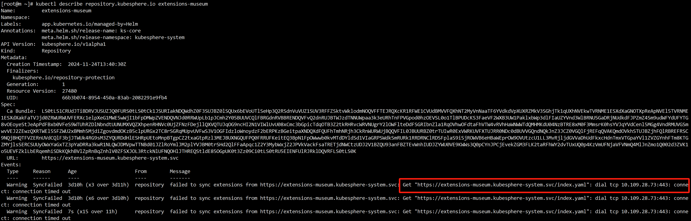
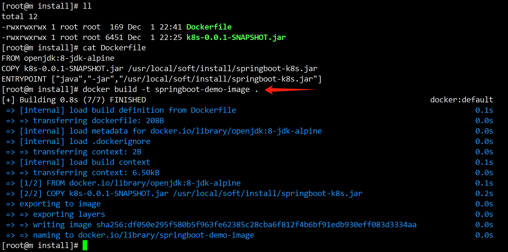
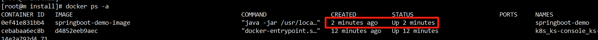
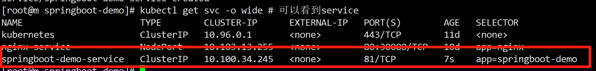
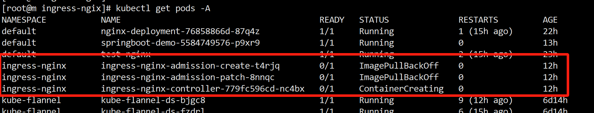
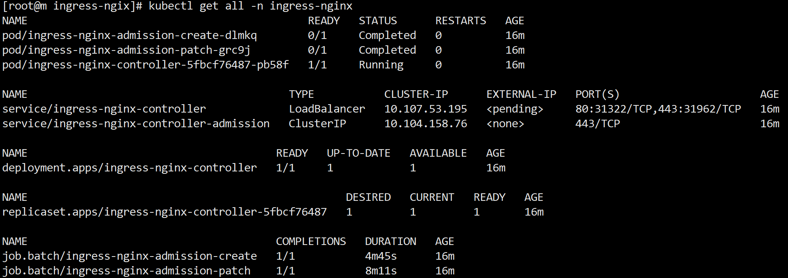
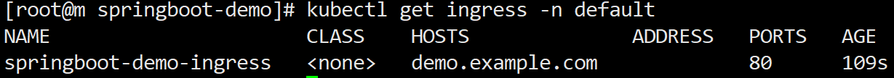

# k8s实战

## 常见问题

### 虚拟机激活后kubesphere登录不了
重启虚拟机，等待1min左右

### kubesphere扩展市场组件为空

```shell
kubectl describe repository.kubesphere.io extensions-museum
kubectl describe repository extensions-museum -n kubesphere-system

kubectl get repository extensions-museum -o yaml # 检查看看最近的同步时间
kubectl describe repository extensions-museum   # 检查看看有没有异常的事件

# 查看问题
kubectl get pods -A -o wide  # 发现 kubesphere-system   restart-extensions-museum-28876320-8kqfj   0/1     Completed
kubectl logs extensions-museum-6849d977f-plxs5 -n kubesphere-system
# 进pod
kubectl exec -it extensions-museum-6849d977f-plxs5 -n kubesphere-system -- /bin/sh

```
如上都不解决，重启所有节点就好了




-------
### 将springboot部署到docker
本地操作笔记
>参考地址:  https://www.bilibili.com/video/BV1ns421N75S/?spm_id_from=333.337.search-card.all.click&vd_source=e4e3d8293807b0aba95e2ad8f2292f7b

- 拉取基础openjdk(基于所有节点，因为分配随机性)
```shell
docker pull openjdk:8-jdk-alpine  
docker images
# 有的时候拉取很慢，可以从成功的机器复制到其他未成功机器
# docker save -o ./image.tar openjdk:8-jdk-alpine  # 将成功镜像保存
# docker load -i ./image.tar  # 未成功拉取机器重载
```

- 编写 Dockerfile;并且将springboot项目放到docker机器上 <br/>
vim Dockerfile 如下
```shell
FROM openjdk:8-jdk-alpine
COPY k8s-0.0.1-SNAPSHOT.jar /usr/local/soft/install/springboot-k8s.jar
ENTRYPOINT ["java","-jar","/usr/local/soft/install/springboot-k8s.jar"]
```

- 创建镜像
```shell
docker build -t springboot-demo-image .  # “.” 表示当前目录
docker images # 查看能看到刚刚操作的本地镜像
```


- 运行镜像
```shell
docker run -d --name springboot-demo springboot-demo-image # 第一个参数是容器名; 第二个参数是镜像名字
docker ps -a  # 可以查看到下图的镜像
docker inspect springboot-demo  # 可以查看到 容器具体信息；注意: 这里会有一个参数： "IPAddress": "172.17.0.2",
```

```shell
# 验证结果，这个ip是通过: inspect springboot-demo 里面的IPAddress得到的  
curl 172.17.0.2:8888/hello?name=lisi # 在linux控制台输入  
# 理论返回Hello lisi #输出结果，容器启动成功，镜像ok
```
<br/>

------
### 将springboot部署到k8s
思路：根据上步骤制作的镜像，利用 xx.yaml 文件部署到k8s中

- 编写部署yaml文件(如下代码在master执行即可，因为自动影响其他节点) <br/>
vim springboot-demo-deployment.yaml
```shell
# springboot-demo-deployment.yaml
# 这部分用于部署： Pod
apiVersion: apps/v1
kind: Deployment
metadata:
  name: springboot-demo
spec:
  replicas: 1
  selector:
    matchLabels:
      app: springboot-demo
  template:
    metadata:
      labels:
        app: springboot-demo
    spec:
      containers:
        - name: springboot-demo
          image: springboot-demo-image
          imagePullPolicy: Never # 当前节点有镜像，则不拉取远程镜像
          ports:
            - containerPort: 8888 # 这里其实容器里面的jar包端口
```
> kubectl apply -f springboot-demo-deployment.yaml <br/>
> kubectl get pods -o wide   # 可以看到pod上部署的demo应用

- 编写service文件
vim springboot-demo-service.yaml
```shell
# 创建Pod的service
apiVersion: v1
kind: Service
metadata:
  name: springboot-demo-service
spec:
  selector:
    app: springboot-demo # 这个要和deploy保持一致
  ports:
    - port: 81
      protocol: TCP
      targetPort: 8888 # 应用端口
```
继续执行如下命令用于部署service
```shell
kubectl apply -f springboot-demo-service.yaml 
kubectl get svc -o wide # 可以看到service  
# 验证, 这里一般也称为 四层负载 
// todo 这里需要进一步验证了
curl 10.100.34.245:81/hello?name=lisi # 在linux控制台输入  这里的 xxxx.xx.xx.x 是cluster-ip(service节点)
# 理论返回 Hello lisi #输出结果，容器启动成功，镜像ok
```


- 安装ingress-nginx
```shell
#阿里云提供了 Helm Chart 的镜像加速服务，您可以添加阿里云的 Helm 仓库： 感觉没啥用
helm repo add ingress-nginx https://kubernetes.oss-cn-hangzhou.aliyuncs.com/charts
#更新仓库
helm repo update
#从 GitHub 上下载最新的 Ingress NGINX 安装文件，并应用它们：
kubectl apply -f https://raw.githubusercontent.com/kubernetes/ingress-nginx/controller-v1.8.0/deploy/static/provider/cloud/deploy.yaml
# 或者通过下面命令实现
# wget -O deploy.yaml https://raw.githubusercontent.com/kubernetes/ingress-nginx/controller-v1.8.0/deploy/static/provider/cloud/deploy.yaml
# kubectl apply -f deploy.yaml
#验证 
kubectl get all -n ingress-nginx
kubectl get pod -n ingress-nginx
```
如果未安装成功



删除重新安装
```shell
# 删除命名空间中的所有资源
kubectl delete all --all -n ingress-nginx
# 删除命名空间，上面命令够了
# kubectl delete namespace ingress-nginx
```

依旧没有解决，可以考虑网友方法,下图显示安装成功
```shell
# 重新安装依旧没有成功  参考:  https://www.jb51.net/article/242695.htm
# 本地使用的新yaml文件已经编辑好了,在: docs/monitor-tuning/08/ext-assets/k8s/ingress-nginx.deploy.yaml
kubectl apply -f 上述文件
```


- 新建 ingress
```shell
# 本地使用的新yaml文件已经编辑好了,在: docs/monitor-tuning/08/ext-assets/k8s/ingress-to-demo.yaml
kubectl apply -f 上述文件
#  检查 Ingress 是否成功创建，并查看其状态
kubectl get ingress -n default
```


测试:
```shell
[root@m springboot-demo]# kubectl get svc -o wide
NAME                      TYPE        CLUSTER-IP      EXTERNAL-IP   PORT(S)        AGE     SELECTOR
kubernetes                ClusterIP   10.96.0.1       <none>        443/TCP        14d     <none>
nginx-service             NodePort    10.103.13.255   <none>        80:30080/TCP   14d     app=nginx
springboot-demo           ClusterIP   10.104.70.129   <none>        80/TCP         3d15h   app=springboot-demo
springboot-demo-service   NodePort    10.100.34.245   <none>        81:30120/TCP   3d15h   app=springboot-demo
[root@m springboot-demo]# curl 192.168.42.21:30120/hello  #采用NodePort访问(个人理解直接发送pod)
Hello unknown user
[root@m springboot-demo]# curl 10.104.70.129:80/hello  #采用ClusterIP访问
Hello unknown user
[root@m ~]# kubectl get svc -n ingress-nginx # 可以看到端口: 31322 是外部暴露的端口
NAME                                 TYPE           CLUSTER-IP      EXTERNAL-IP   PORT(S)                      AGE
ingress-nginx-controller             LoadBalancer   10.107.53.195   <pending>     80:31322/TCP,443:31962/TCP   24h
ingress-nginx-controller-admission   ClusterIP      10.104.158.76   <none>        443/TCP                      24h
[root@m ~]# curl http://demo.example.com:31322/hello?name=leo  # 通过ingress-nginx正常访问
Hello leo
```